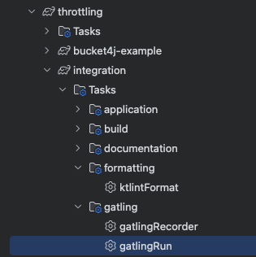

## Best Practices

---
### rest 적용 예제

1. `application.yml`에서 redis rate limiter 설정을 비활성화
    ```yaml
      redis:
        rate:
            limiter:
              enabled: false
    ```
2. `PricingPlanLimitFilter` 를 확인하시면 로컬 캐시를 통해 Rate Limiter 를 구현한 것을 확인할 수 있습니다.

3. 부하 테스트 실행하기
   - gradle task tree에서 `gatlingRun` 을 실행합니다.
      
   - cli 에서 `gatlingRun` 을 실행합니다.
     ``` bash
       ./gradlew gatlingRun
     ```

4. 분산 환경에서 사용할 경우 Redis Rate Limiter 를 사용하시면 됩니다.
   - doker 디렉토리에 redis 를 실행합니다.
     - docker-compose.yml 파일을 확인하시면 됩니다.
     ```bash
        docker-compose -f ../../docker/redis/docker-compose.yml up -d
     ```
   - `application.yml`에서 redis rate limiter 설정을 활성화
   ```yaml
   redis:
      rate:
        limiter:
          enabled: true
   ```

5. 테스트 환경 구성 
   

6. Makefile 을 통해 테스트 환경을 구성합니다.
   ```bash
   make run
   ```

7. 3번 과정과 동일하게 부하 테스트를 실행합니다.
